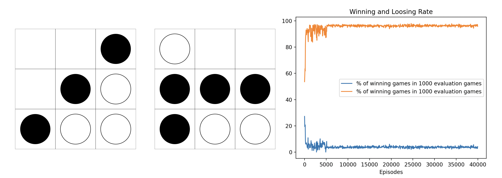

# Connect-3 Q-Learning ReadMe


## Overview

This repository contains Python code for implementing a Q-learning algorithm to train an agent for playing Connect-3, a simplified version of Connect-4 on a 3x3 grid. The code includes the following files:

- `q_learn.py`: Defines the Q-learning algorithm for training the agent against a randomized opponent.
- `connect_3_classes.py`: Contains classes for the Connect-3 game environment and the agent.
- `train.py`: Executes the training process for the agent using Q-learning and evaluates its performance.
- `evaluate.py`: Evaluates the agent's performance over a specified number of episodes.
- `README.md`: Provides an overview of the code and instructions for use.

## Instructions

1. **Dependencies:**
   - Ensure that you have Python installed on your system.
   - The code uses standard libraries. Install them using:
     ```bash
     pip install matplotlib
     pip install numpy
     ```

2. **Code Structure:**

   - `q_learn.py`: Implements the Q-learning algorithm with a training loop.
   - `connect_3_classes.py`: Defines the Connect-3 game environment and the agent class.
   - `train.py`: Executes the training process and evaluates the trained agent.
   - `evaluate.py`: Evaluates the agent's performance.

3. **Training:**

   - Run `train.py` to initiate the training process.
   - Adjust the `episodes` parameter in `q_learn` to control the number of training episodes.

4. **Evaluation:**

   - The training process includes periodic evaluations (every 50 episodes) using the `evaluate_agent` function.
   - The evaluation results, including average win and loss rates, are printed during training.

5. **Plotting:**

   - The `plot_losses` function in `train.py` generates a plot of the training progress, showing the percentage of wins and losses over episodes.
   - Uncomment the `plt.yscale('log')` line in `plot_losses` for a logarithmic scale.

6. **Adjusting Parameters:**

   - Modify the Q-learning parameters, either for training in train.py. Both learning & exploration rate are decayed every 50 epochs. Adjust the decaying behaviour in q_learn.py. 
7. **Customization:**

   - Extend or modify the code for additional experiments, such as changing the game environment, agent strategies, or training parameters.

8. **Running Evaluation Only:**

   - If you have a pre-trained agent and want to evaluate its performance, use `evaluate.py` by creating an instance of the agent and providing its Q-table.

```python
# Example:
trained_agent = agent(exp_rate=0, q_table=learned_q_table)
evaluate_agent(trained_agent, eval_episodes=1000)
```

## Contributors

- This code was developed by Kenneth Styppa.

## Acknowledgments
- Special thanks to Dr. Stefan Richter for his engaging course in statistical analysis of machine learning algorithms.

Feel free to reach out for any questions or improvements!
